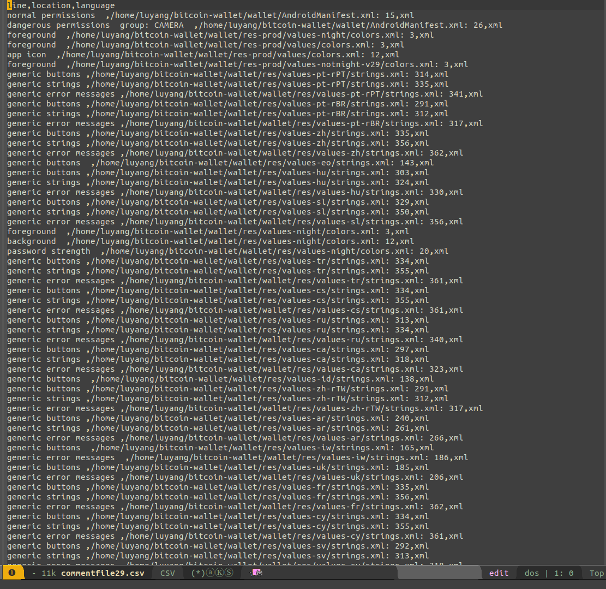

# Speedy Comment Extractor

 

<!-- markdown-toc start - Don't edit this section. Run M-x markdown-toc-refresh-toc -->
**Table of Contents**

- [value centred programming](#value-centred-programming)
    - [Usage](#usage)
        - [Setting up dependencies](#setting-up-dependencies)
        - [To get comments from directory:](#to-get-comments-from-directory)
        - [To get comments from repostort:](#to-get-comments-from-repostort)
    - [Limitations](#limitations)
        - [Does not support all encoding](#does-not-support-all-encoding)
        - [Supported languages](#supported-languages)
    - [Known bugs](#known-bugs)

<!-- markdown-toc end -->

## About
Can extract all comments from linux kernal repo in less than 30 minutes on most modern laptops. That's all you need to know.

It stores the comments inside an .csv file like so:



## Usage

### Setting up dependencies
```shell
./requirements.sh
```

### To get comments from directory: 

```shell
python3 driver.py -d <root directory>
```
### To get comments from repostories: 

```bash
python3 driver.py -repo <repository link> <branch name> <depth>
```


## Limitations

### Does not support all encoding

### Supported languages
* html_comment 
* batch_comment 
* css_comment 
* xml_comment 
* c_comment 
* kotlin_comment 
* cpp_comment 
* javascript_comment 
* gradle_comment 
* java_comment 
* build_comment 
* python_comment
* asm_comment
* makefile_comment 
* shell_comment 
* perl_comment

## Known bugs
* Perl support is still unstable
* Multi line comments have too many whitespace for spacing between words

